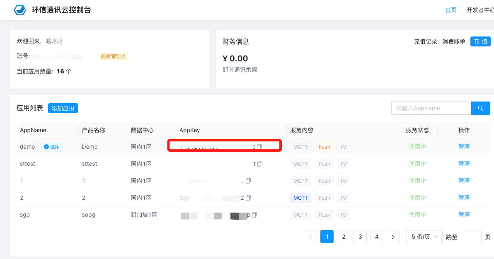
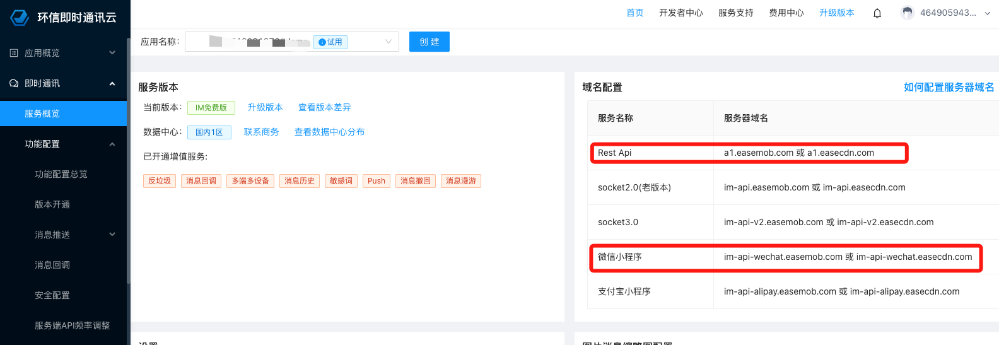

# Easemob UIKit Demo (Vue3)

<Toc />

环信单群聊 UIKit 是基于环信即时通讯云 IM SDK 开发的一款即时通讯 UI 组件库，提供各种组件实现会话列表、聊天界面、联系人列表及后续界面等功能，帮助开发者根据实际业务需求快速搭建包含 UI 界面的即时通讯应用。

示例项目中上传头像，获取群组头像功能依赖 app server 来实现，如果你要实现自己的 app server，请参考app server [示例代码](https://github.com/easemob/easemob-demo-appserver/tree/dev-demo)。需要确保 app server 中使用的 appKey 和本项目中配置的是相同的。


## 支持平台（vue3）

- Android
- iOS
- 微信小程序
- H5

## 静态资源说明

UIKit中依赖的静态资源（`ChatUIKit/assets`）放置在环信服务器中,有访问频率限制，建议您将静态资源放置在您的业务服务器上，然后修改 `ChatUIKit/const/index.ts` 文件中的 `ASSETS_URL` 为您的资源服务器地址。

## 快速跑通DEMO

### 1.下载 `easemob-uikit-uniapp` 项目并安装依赖


下载源码到你当前的工作空间 ${workspace}

```bash
git clone https://github.com/easemob/easemob-uikit-uniapp.git
```

切换路径到 `${workspace}/easemob-uikit-uniapp/demo` 中，并安装项目依赖。

```bash
cd easemob-uikit-uniapp/demo && npm i
```

## 页面切换说明

### ChatUIKit 默认页面切换方式
ChatUIKit 组件库中，页面级别的切换默认使用 `uni.redirectTo` 方法实现。这是因为组件库设计时考虑到大多数场景下，聊天、联系人、群组等功能作为应用的一部分，需要在应用内部进行页面跳转，而不是作为独立的 tab 页面。

### Demo 中的页面切换方式
在本示例项目中，由于采用了 tabbar 导航结构（将聊天、联系人、群组等作为底部 tab），因此使用了 `uni.switchTab` 方法进行页面切换。这是因为在 uni-app 中，tabBar 页面的切换必须使用 `uni.switchTab` 方法，而不能使用其他页面跳转方法。

### 自定义页面切换
如果您在集成 ChatUIKit 时需要使用不同的页面切换方式，可以根据您的应用架构选择合适的 uni-app 页面跳转方法：
- `uni.navigateTo`：保留当前页面，跳转到应用内的某个页面
- `uni.redirectTo`：关闭当前页面，跳转到应用内的某个页面
- `uni.switchTab`：跳转到 tabBar 页面，并关闭其他所有非 tabBar 页面
- `uni.reLaunch`：关闭所有页面，打开到应用内的某个页面

请根据您的实际需求和应用架构选择合适的页面切换方法，并在相应的组件回调中进行自定义实现。

## copy-chat-uikit.js 脚本说明

### 脚本用途
`copy-chat-uikit.js` 是一个用于将根目录下的 `ChatUIKit` 文件夹复制到 `demo` 目录中的自动化脚本。该脚本的主要功能是：
- 递归删除 `demo/ChatUIKit` 目录（如果存在）
- 将根目录下的 `ChatUIKit` 文件夹及其所有内容复制到 `demo` 目录中

### 使用方法
在 `demo` 目录下执行以下命令：
```bash
npm run copy:uikit
```

### 注意事项
1. **源码覆盖风险**：运行此脚本后，`demo/ChatUIKit` 目录中的所有现有文件将被根目录下的 `ChatUIKit` 文件完全覆盖。如果您在 `demo/ChatUIKit` 中进行了自定义修改，请务必先备份这些修改。

2. **页面跳转方式**：如前所述，ChatUIKit 组件库默认使用 `uni.redirectTo` 进行页面跳转，但 demo 项目由于使用了 tabbar 结构，部分页面跳转使用了 `uni.switchTab`。在复制源码后，请注意检查并根据您的项目结构调整页面跳转方式。

3. **依赖关系**：确保您的项目已安装所需依赖，特别是 `mobx`，它是 ChatUIKit 的核心依赖之一。

### 2. 通过 HBuilderX打开demo项目

通过 [HBuilderX](https://dcloud.io/hbuilderx.html) 打开项目中的 demo 文件夹, 即 `${workspace}/easemob-uikit-uniapp/demo`

### 3. 获取环信AppKey和服务连接地址

AppKey和服务器连接地址可在 [环信即时通讯云控制台](https://console.easemob.com/) 中获取。

在应用列表中获取AppKey



点击管理进入`即时通讯/服务概览`，获取您的服务连接地址




将获得的appKey和服务器连接地址，赋值给 `${workspace}/easemob-uikit-uniapp/demo/const/index.ts` 文件中的 `APPKEY`、 `API_URL` 和 `URL` 参数。

```javascript
const APPKEY = "";  // 环信appkey
const API_URL = "" // 环信 rest api地址 https协议
const URL = "" // 环信 websocket 地址 wss协议
```

### 第四步：使用 HBuilderX 运行 demo

打开 HBuilderX 工具栏 -> 运行, 选择指定运行平台, 例如浏览器, 然后点击运行


## demo体验

- [H5](https://uniapp-h5.easemob.com/);
- [Android](https://www.pgyer.com/unggU6xu);
- [iOS](https://www.pgyer.com/LvuQvWCN);

## 相关链接

- [集成文档](https://doc.easemob.com/uikit/chatuikit/uniapp/chatuikit_integrated.html);


